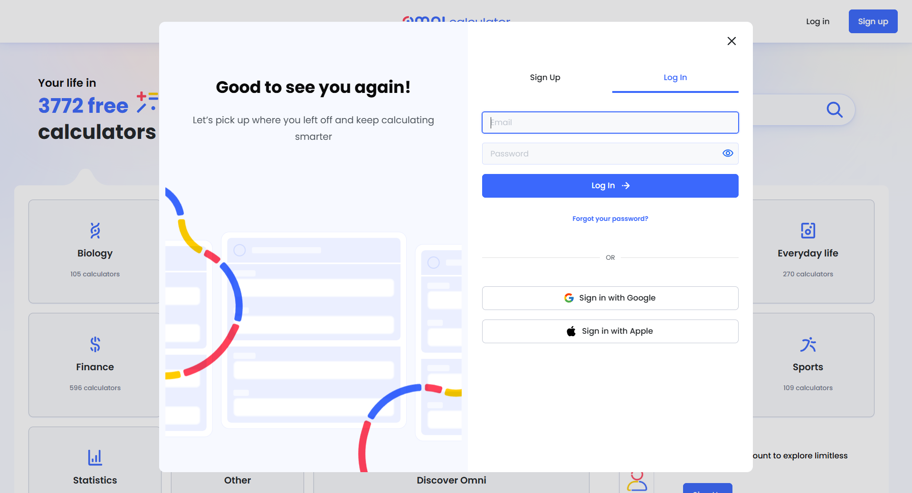

# 1、

如图所示，请对本页面做如下调整：

- 当前`5 PM`所对应的网格线下面留出来的空闲区域太大，比较浪费，请参考最右侧网格距离边缘的距离，进行调整。
- 网格需要自适应适配，也就是根据访问用户的屏幕大小，自动调整网格的大小来适配屏幕。如果网格不能显示全的话，需要在横向和纵向加滚动条。

# 2、

如图所示，调整之后，页面出现了新的问题。在日历的下方出现了一大片的空白区。你需要解决这个出现空白区域的问题。我认为应该是对网格做自适应的适配。

- 网格需要自适应适配，也就是根据访问用户的屏幕大小，自动调整网格的大小来适配屏幕。也就是说，无论何时都让日历的这块区域布满屏幕。

- 同时，如果网格不能显示全的话，需要在横向和纵向加滚动条。

网格能够自适应进行调整了，但是网格上的卡片显示异常，如图所示。请保证卡片的显示效果保持原样。

如图所示，请对日历区域的日期功能进行调整。

- 首先请保证日历区域显示的日期跟真实日期是能对应上的，而不是虚构的
- 当我点击右侧的箭头时，会跳转到下一个7天。当我点击左侧的箭头时，会跳转到上一个7天。
- 星期下面对应的几号也要保证准确。就比如说MON（星期一）对应的其实应该是10月22号，所以它下面的数字应该是22

如图所示，请实现日视图和周视图切换的功能。

- 当用户点击`week`时，右侧的日历页面是周视图，也就是现在这个页面
- 当用户点击`day`时，右侧的日历页面是日视图，需要你根据咱们已有的周视图风格，去生成一下日视图。

# 3、

为日历区域的事件卡片增加上下拖拽的功能，我以THU(星期四)上的那个卡片为例：

- 可以拖拽的范围，也就是日历上显示的时间轴范围，就比如当前这个日历显示的时间范围是早上8点到下午5点。
- 当卡片拖拽到最高点时，卡片的上边缘跟早上8点的时间轴对齐。当卡片拖拽到最低点时，卡片的下边缘跟下午5点的时间轴对齐。
- 当卡片进行拖拽时，卡片上显示的时间(9:00 - 11:00)要进行动态的、实时的调整。

如图中红框范围所示，当我把事件卡片拖到时间轴的最底部时，事件卡片上显示的时间范围是`3:00 - 5:00`，但是事件卡片超出了网格的范围。事件卡片应该停留在下午3点到下午5点的位置，但是现在更像是停留在了3点10分到5点10分的位置。存在显示不准确的问题，需要调整。

我发现了一个错误。当我创建一个新的事件卡片时，就比如说2025年的10月9号星期二上午8点到9点，这个事件卡片不仅会出现在对应的网格里，而且还会出现在所有日期为星期二的网格里，就比如说2025年的10月16号也会出现这个卡片。这是个错误，需要修改

一、关于登录和注册

我的想法是这样的，比如说我当前停留在网站的首页上，当我点击导航栏上的`log in`或者`sign up`时，并不是跳转到`log in`或者`sign up`的页面；而是在首页页面上弹出一个`log in`或者`sign up`对话框。

同样的道理，比如说当我停留在网站的`blog`页面上时，当我点击导航栏上的`log in`或者`sign up`时，在`blog`页面上弹出一个`log in`或者`sign up`对话框。

你可以参考一下我发的这张图片。

二、关于路由保护

应该不叫middleware.ts，应该叫proxy.ts，关于这一点，你可以再核对一下。

# 4、

> 请注意，我用同一个账号对支付系统进行了测试，是同一个账号。
>
> > 当我先购买 7-day pass 服务时，supabase数据库里增加了一条记录A
> >
> > 然后当我购买 monthly 服务时，supabase数据库里重写了这条记录A，相当于 7-day pass 的购买服务记录被覆盖掉了
> >
> > 然后当我购买 lifetime 服务时，supabase数据库里继续重写了这条记录A，相当于 7-day pass 和 monthly 购买服务记录被全都被覆盖掉了
>
> 你认为数据库的这种写入方式是否合理，这个需要论证一下。
>
> 
>
> 你确实应该考虑这个防降级逻辑。但是我希望把问题考虑的更加仔细，所以让我来帮你拆分一下具体的情况。你来分析一下以下具体情况
>
> # 一、首先是免费用户
>
> 那么他可以选择 `7-day pass` 、`monthly` 和 `lifetime` 的服务。
>
> # 二、如果用户已经付费了`7-day pass`的服务。
>
> ## 1、那么他可不可以继续购买`7-day pass`的服务？
>
> - 如果不可以的话，那么当用户继续点击要订阅`7-day pass`的服务时，应该提醒他不能重复购买
> - 如果可以的话，那么它的持续时间就变成了7+7=14天
>
> ## 2、那么他可不可以继续购买`monthly`的服务？
>
> - 如果不可以的话，那么当用户继续点击要订阅`monthly`的服务时，应该提醒他当前已经有`7-day pass`的服务在使用。
> - 如果可以的话，那么它的持续时间就变成了30天（or 31天 or 28天，视月份而定）+7天
>
> ## 3、那么他可不可以继续购买`lifetime`的服务？
>
> 我的想法是可以，购买lifetime的服务之后，会覆盖掉之前的服务。
>
> # 二、如果用户已经付费了`monthly`的服务。
>
> ## 1、那么他可不可以继续购买`7-day pass`的服务？
>
> - 如果不可以的话，那么当用户继续点击要订阅`7-day pass`的服务时，应该提醒他当前已经有`monthly`的服务在使用。
> - 如果可以的话，那么它的持续时间就变成了30天（or 31天 or 28天，视月份而定）+7天
>
> ## 2、那么他可不可以继续购买`monthly`的服务？
>
> - 如果不可以的话，那么当用户继续点击要订阅`monthly`的服务时，应该提醒他不能重复购买
> - 如果可以的话，那么它的持续时间就变成了30天（or 31天 or 28天，视月份而定）+ 30天（or 31天 or 28天，视月份而定）
>
> ## 3、那么他可不可以继续购买`lifetime`的服务？
>
> 我的想法是可以，购买lifetime的服务之后，会覆盖掉之前的服务。
>
> # 三、如果用户已经付费了`lifetime`的服务。
>
> ## 1、那么他可不可以继续购买`7-day pass`或者`monthly`的服务？
>
> 我的想法是不可以，提醒用户，您已经是永久用户，无需再付费。
>

# 5、

这是我从supabase数据库里导出来的一条`monthly`用户的记录，关于这条记录，我发现在`expires_at`字段的内容是空的。我想问你的是:

> 1、如果`expires_at`字段的内容是空的，那么，怎么知道这个monthly用户的付费权益什么时候到期？
>
> 2、由于这个`monthly`的付费权益是订阅制，如果某一天，用户在`creem`上取消了订阅，网站如何知道，并且在适当的日期取消该用户的付费权益？

# 6、

执行计划B。

1、我有参考图，请参考我给你发的这张图片。页面的左半部分的设计符合本项目的基调，页面的右半部分是 sign up 和 sign in 的功能。

2、登录+注册都做，可以结合参考图，把登录和注册整合到一个模块框上（至少视觉效果上看起来像是在一个模态框上）

# 7、

有这么几个问题需要解决：

> 1、模态框里的`Log In` ，应该改为叫`Sign In`
>
> 2、模块框的布局现在显得有些紧凑，可以把模态框做得更高一点
>
> 3、模态框里`sign up`和`log in`按钮的相对位置应该固定，现在我点击 sign up 和 log in 按钮来回切换时，他们的位置会一直变化，观感上很不舒服
>
> 4、当我点击 sign up 和 log in 按钮来回切换时，底部的`Sign in with Google`的相对位置也应该固定，不应该给人一种位置一直在变的感觉。
>
> 5、`Forgot your password?`链接无法点击

# 8.

> ## Blog 页面问题分析
>
> 从截图来看，我发现以下几个问题：
>
> ------
>
> ### 1. **缺少真实图片** 🖼️
>
> - 所有文章卡片都显示**占位符图标**（蓝色图片图标），没有实际的博客封面图
> - 这让页面看起来像是未完成的状态，缺乏视觉吸引力
>
> ### 2. **Featured 文章描述被截断**
>
> - "Discover how async communication can transform your team's productivity and reduce meeting fatigue, leading to more focused wor..."
> - 描述文字被截断在 "wor..." 处，用户无法看到完整内容
>
> ### 3. **分类选项过少**
>
> - 目前只有 **"All"** 和 **"Productivity Tips"** 两个分类
> - 如果博客内容增多，用户可能需要更多分类来筛选
>
> ### 4. **文章数量较少**
>
> - 只展示了 3 篇文章，页面下半部分显得比较空
>
> ### 5. **卡片高度不一致**（潜在问题）
>
> - 下方两个卡片的标题长度不同，可能导致卡片高度不一致，影响整体美观
>
> ------
>
> **需要我帮你修复这些问题吗？** 比如：
>
> 1. 为博客文章添加真实的封面图片
> 2. 修复描述截断问题
> 3. 添加更多分类或文章内容

关于你的发现：

> ### 1. **缺少真实图片** 🖼️
>
> - 这个确实如此，你可以尝试为博客的文章添加真实的封面图片
>
> ### 2. **Featured 文章描述被截断**
>
> - 这个我认为不是问题，可以暂时不用管。
>
> ### 3、分类选项过少
>
> - 确实需要增加更多分类
>
> ### 4. **文章数量较少**
>
> - 文章数量确实比较少，你需要增加一些文章，具体文章内容的好坏可以先不用考虑。
>
> ### 5、**卡片高度不一致**（潜在问题）
>
> - 当前下方两个卡片的高度是一致的，并且后续的话也一定要保持一致。
> - 下方两个卡片的标题长度不同，这个我认为不是问题

我补充的问题：

> 1、卡片的排版太混乱，当前左边缘没有对齐。
>
> 2、下面的卡片，每行应该排三个卡片，而不是现在的两个。
>
> 3、名字为Featured Article的那个卡片，它应该等同于下方三个卡片的宽度。

请结合我补充的信息，重新梳理一下本页面存在的问题，给出一个优化的方案。另外我给你附上一张参考图

# 9、

你需要再落实一个问题，当前的blog页面，在下方没有分页的按钮：

> 1、文章数量太少，所以没有出现分页的按钮。
>
> 2、分页的功能就没有做

排查一下原因。如果没有做的话，可以按照参考图上的去设计一下。

# 10、

需要确认的问题：

> 1、Creem 是否提供取消订阅的 API？（需要查阅 Creem 文档）
>
> - 你去查阅一下Creem的文档
>
> 2、或者您希望手动在 Creem Dashboard 处理这种情况？
>
> - 你先进行操作，如果不成功的话，我会去 Creem Dashboard 上查询处理这个情况。

如果未被自动取消，我认为这个地方存在的问题：

> 1、用户会继续被 Creem 每月扣费（自动续订）
>
> 2、下一次月monthly订阅继续扣费时，会更新数据库里的状态，数据库中的 `plan` 会从 `lifetime` 降级为 `monthly`

# 11.

1. **Modal 展示的信息** - 是否需要展示：当前计划、状态、到期时间？还有其他需要的吗？
   - 需要展示当前计划、状态、到期时间，其他内容暂时不考虑
2. Free 用户处理 - 对于免费用户，Modal 是否显示 "Upgrade to Pro" 按钮跳转到 `/pricing` ？
   - 对的，这个逻辑是正确的
3. 语言 - 界面文字使用英文 (符合 `PRD` 的 `en-US` 规范)，对吗？
   - 对的
   

# 12.

> 我已经熟悉了这份 PRD 的全部内容，并将以此作为开发本项目的最高指导标准。**请告诉我您希望从哪个部分开始开发？** 例如：
>
> 1. 继续完善现有的日历编辑器功能？
> 2. 开始实现模板引擎？
> 3. <s>搭建博客系统？</s>
> 4. 其他具体功能？
>
> 1. **继续开发某个特定功能**？（例如：支付系统、模板引擎、博客等）
> 2. **检查当前项目进度与 PRD 的对齐情况**？
> 3. **其他具体任务**？
>
> 我已经熟悉了这份 PRD 的全部内容，并将以此作为开发本项目的最高指导标准。**请告诉我您希望从哪个部分开始开发？** 例如：
>
> 1. 继续完善现有的日历编辑器功能？
> 2. 开始实现模板引擎？
> 3. 搭建博客系统？
> 4. 其他具体功能？
>
> 

