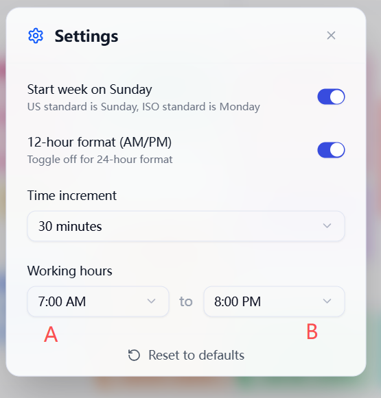

# 1、`stitch`设计首页`UI`

> # 产品定义：
>
> 这是一个现代化的、极简风格的 SaaS 在线排班工具 (Online Schedule Builder)。
>
> # 核心交互与价值：
>
> 这里的核心体验是“零阻力”。用户无需注册登录，进入首页即可看到一个周视图日历。
>
> # **完整的产品页面与功能需求：**
>
> ## `Page Header`
>
> `Page Header`位于页面的最上方。
>
> `Page Header`的左侧为网站的logo以及网站名字；
>
> `Page Header`的的中间部分为product、pricing和blog选项，当用户的鼠标停留在对应的选项名字时，该选项的颜色发生变化
>
> `Page Header`的右侧部分为`log in`和`sign up`。
>
> ## **核心编辑器 (首页/工具页 - 最重要)**
>
> ### **布局：**
>
> 经典的 SaaS 布局。左侧是“侧边栏”，右侧是“日历网格”。
>
> ### **左侧侧边栏：**
>
> 有“添加新项目”、“导出/下载”、切换（日/周）、“AI 自动填充”按钮（带闪光特效）、settings、reset等等功能按钮。
>
> ### **右侧日历区：**
>
> -  一个标准的周视图表格 (Mon-Sun)，表格中有时间轴，表格内显示已经排好的任务块。
> -  用户可以在日历网格中任意拖拽任务块，从而完成排班。
> -  任务块上会显示当前所在的时间范围，如8点35分到11点26分。
> -  周视图表格 (Mon-Sun)上方会显示日期，比如“< October 21 - 27,2025 >”，日期可以根据使用者的要求，向前向后调整
>
> ## UI 风格要求：
>
> - **风格：** Clean SaaS, Minimalist, Linear-style (类似 Linear 或 Notion 的质感)。
> - **配色：** 以黑白灰为主，用一种鲜明的强调色（如靛蓝色或薄荷绿）来区分“排班色块”和“主按钮”。
> - **字体：** 现代无衬线字体 (Inter 或 San Francisco)。
>
> ## 输出要求：
>
> - 我需要以上提到的所有关键界面的高保真 UI 设计稿。

# 2、`v0`生成用户界面

> You are an expert React/Tailwind developer. I have attached a screenshot of a "Weekly Schedule Builder" UI. Please recreate this interface pixel-perfectly using React, Tailwind CSS, and Lucide React for icons.
>
> Use `shadcn/ui` components where appropriate (Button, Card, Tabs, Select).
>
> Here are the specific implementation details based on the design:
>
> 1. **Layout Architecture:**
>    - A full-screen layout with a fixed Top Navigation Bar, a fixed Left Sidebar (approx 250px width), and a main Scrollable Calendar Area on the right.
>    - Font: Use a clean sans-serif font (Inter or similar).
>
> 2. **Top Navigation:**
>    - Left: Brand Logo "Schedule Builder" (icon + text).
>    - Center: Links "Product", "Pricing", "Blog".
>    - Right: "Log In" (Ghost variant button) and "Sign Up" (Solid Blue primary button).
>
> 3. **Left Sidebar:**
>    - Top: A large, primary blue button "Add New Item" (with Plus icon).
>    - Below it: A Segmented Control/Tabs for "Day" vs "Week" view.
>    - Menu Items: "Export/Download", "Settings", "Reset" (Ghost styling, gray text, with icons).
>    - Bottom: A distinctive "AI Autofill" button. IMPORTANT: Use a purple-to-blue gradient background for this button to match the screenshot, with a sparkle icon.
>
> 4. **Main Calendar Area (The Grid):**
>    - Header: Centered date range "October 21 - 27, 2025" with Left/Right chevron arrows.
>    - The Grid Structure:
>      - Use CSS Grid. First column for Time Labels (8 AM - 5 PM).
>      - Next 7 columns for Days (Mon 21 - Sun 27).
>      - Light gray borders (`border-gray-100` or `200`) for the grid lines.
>    - **Event Cards (The Chips):**
>      - Create sample event cards placed absolutely or within grid cells (e.g., "Team Sync", "Design Review", "Lunch Break").
>      - Styling: Light blue background (`bg-blue-100`), Dark blue text (`text-blue-700`), and a thick dark blue left border (`border-l-4 border-blue-600`).
>      - Content: Title bold, sub-id (e.g., 123456) small, Time range at bottom.
>
> 5. **Color Palette:**
>    - Primary Blue: Approx `#2563EB` (Tailwind `blue-600`).
>    - Background: White.
>    - Text: Slate/Gray for secondary text.
>
> 6. **Technical Constraints:**
>    - Use `grid` for the calendar layout to ensure alignment.
>    - Ensure the layout is responsive but optimized for desktop view as shown.
>    - Hardcode the sample data shown in the image so the preview looks exactly like the screenshot.

## 翻译

> 您是一位专业的 React/Tailwind 开发人员。我已附上“每周日程安排生成器”用户界面的截图。
>
> 请使用 React、Tailwind CSS 和 Lucide React 图标库，像素级完美地重现此界面。
>
> 请在适当的地方使用 `shadcn/ui` 组件（例如 Button、Card、Tabs、Select）。
>
> 以下是基于设计稿的具体实现细节：
>
> 1. 产品定义：
>
> - 这是一个现代化的、极简风格的 SaaS 在线排班工具 (Online Schedule Builder)。
>
>
> 2. **布局架构：**
>
> - 全屏布局，包含固定顶部导航栏、固定左侧边栏（宽度约为 250px）和右侧可滚动的日历主区域。 
> - 字体：使用简洁的无衬线字体（例如 Inter 或类似字体）。
>
> 3. **顶部导航栏：**
>
> - 左侧：品牌徽标“Schedule Builder”（图标 + 文字）。 
> - 中间：链接“产品”、“定价”、“博客”。 
> - 右侧：“登录”（透明按钮）和“注册”（蓝色实心主按钮）。
>
> 4. **左侧边栏：**
>
> - 顶部：一个大型蓝色主按钮“添加新项目”（带加号图标）。 
> - 下方：用于切换“日”视图和“周”视图的选项卡/分段控件。 
> - 菜单项：“导出/下载”、“设置”、“重置”（透明样式，灰色文字，带图标）。 
> - 底部：一个醒目的“AI 自动填充”按钮。重要提示：此按钮的背景应使用紫色到蓝色的渐变色，并带有闪光图标，以匹配截图。
>
> 5. **日历主区域（网格）：**
>
> - 标题：
>   - 居中显示日期范围“2025 年 10 月 21 日 - 27 日”，两侧带有左右箭头。 
>
> - 网格结构：
>   - 使用 CSS Grid。第一列用于时间标签（上午 8 点 - 下午 5 点）。 
>   - 接下来 7 列用于星期（周一 21 日 - 周日 27 日）。 
>   - 网格线使用浅灰色边框（`border-gray-100` 或 `200`）。
>   - 网格结构会根据屏幕的尺寸进行动态的调整，以进行适配
>
> - **事件卡片（标签）：**
>   - 创建示例事件卡片，并将其绝对定位或放置在网格单元格内（例如，“团队同步”、“设计评审”、“午餐休息”）。事件卡片覆盖在网格结构上方
>   - 样式：浅蓝色背景 (`bg-blue-100`)，深蓝色文本 (`text-blue-700`)，以及粗实的深蓝色左边框 (`border-l-4 border-blue-600`)。
>   - 事件卡片可以在当天范围内进行上下拖拽。
>
> - 内容：
>   - 标题加粗，内容（例如 123456）字体较小，时间范围显示在底部。
>
> - 颜色：
>   - 日历主区域颜色比顶部导航栏和左侧边栏颜色稍微深一点
>
>
> 6. **颜色方案：**
>
> - 主色调蓝色：大约 `#2563EB`（Tailwind `blue-600`）。
> - 背景：白色。
> - 文本：辅助文本使用石板灰/灰色。
>
> 7. **技术限制：**
>
> - 使用 `grid` 布局来实现日历布局，确保对齐。
> - 确保布局具有响应式设计，但以所示的桌面视图为优化目标。
> - 硬编码图像中显示的示例数据，使预览效果与截图完全一致。

# 3、auth google

> # Authentication System Implementation Plan (v2)
>
> ## Goal
>
> Implement user registration and login functionality using **Clerk** with **modal dialogs** (no page redirects). Use Next.js 16's `proxy.ts` for route protection.
>
> ------
>
> ## User Review Required
>
> IMPORTANT
>
> You will need to create a Clerk account at [clerk.com](https://clerk.com/) and provide:
>
> - `NEXT_PUBLIC_CLERK_PUBLISHABLE_KEY`
> - `CLERK_SECRET_KEY`
>
> ------
>
> ## Proposed Changes
>
> ### Dependencies
>
> #### [MODIFY] package.json
>
> ```
> + "@clerk/nextjs": "^6.x"
> ```
>
> ------
>
> ### Environment Configuration
>
> #### [MODIFY] .env.local
>
> ```
> NEXT_PUBLIC_CLERK_PUBLISHABLE_KEY=pk_test_xxxxx
> 
> CLERK_SECRET_KEY=sk_test_xxxxx
> ```
>
> NOTE
>
> Modal mode does NOT require `SIGN_IN_URL` or `SIGN_UP_URL` environment variables since we're not using separate pages.
>
> ------
>
> ### Core Integration
>
> #### [MODIFY] layout.tsx
>
> Wrap application with `ClerkProvider`.
>
> ------
>
> ### Navbar Integration (Modal Approach)
>
> #### [MODIFY] navbar.tsx
>
> Replace placeholder buttons with Clerk's modal components:
>
> ```
> import { SignInButton, SignUpButton, SignedIn, SignedOut, UserButton } from "@clerk/nextjs"
> 
> 
> 
> // When signed out:
> 
> <SignedOut>
> 
>   <SignInButton mode="modal">
> 
>     <Button variant="ghost">Log In</Button>
> 
>   </SignInButton>
> 
>   <SignUpButton mode="modal">
> 
>     <Button>Sign Up</Button>
> 
>   </SignUpButton>
> 
> </SignedOut>
> 
> 
> 
> // When signed in:
> 
> <SignedIn>
> 
>   <UserButton />
> 
> </SignedIn>
> ```
>
> **Key difference**: `mode="modal"` makes auth appear as overlay dialog on current page (as shown in your reference image).
>
> ------
>
> ### Route Protection
>
> #### [NEW] proxy.ts
>
> Configure Clerk proxy for route protection (Next.js 16 convention):
>
> ```
> import { clerkMiddleware } from "@clerk/nextjs/server"
> 
> 
> 
> export default clerkMiddleware()
> 
> 
> 
> export const config = {
> 
>   matcher: [
> 
>     "/((?!_next|[^?]*\\.(?:html?|css|js(?!on)|jpe?g|webp|png|gif|svg|ttf|woff2?|ico|csv|docx?|xlsx?|zip|webmanifest)).*)",
> 
>   ],
> 
> }
> ```
>
> NOTE
>
> By default all routes are public. Protected routes for premium features can be added later.
>
> ------
>
> ## Verification Plan
>
> ### Manual Browser Testing
>
> 1. Click "Sign Up" → Modal appears on current page (no navigation)
> 2. Click "Log In" → Modal appears on current page (no navigation)
> 3. Complete registration/login → Modal closes, user avatar appears in navbar
> 4. Click avatar → Sign out option available
> 5. Test on multiple pages (home, blog) → Modal works consistently

## 翻译

> # 身份验证系统实施方案（v2）
>
> ## 目标
>
> 使用 **Clerk** 和 **模态对话框**（不进行页面重定向）实现用户注册和登录功能。使用 Next.js 16 的 `proxy.ts` 进行路由保护。
>
> ------
>
> ## 用户审核
>
> 重要
>
> 您需要在 [clerk.com](https://clerk.com/) 创建一个 Clerk 帐户，并提供以下信息：
>
> - `NEXT_PUBLIC_CLERK_PUBLISHABLE_KEY`
>
> - `CLERK_SECRET_KEY`
>
> ------
>
> ## 建议的更改
>
> ### 依赖项
>
> #### [修改] package.json
>
> ```
> + "@clerk/nextjs": "^6.x"
> 
> ```
>
> ------
>
> ### 环境配置
>
> #### [修改] .env.local
>
> ```
> NEXT_PUBLIC_CLERK_PUBLISHABLE_KEY=pk_test_xxxxx
> 
> CLERK_SECRET_KEY=sk_test_xxxxx
> 
> ```
>
> 注意
>
> 由于我们已启用模态模式，因此模态模式不需要 `SIGN_IN_URL` 或 `SIGN_UP_URL` 环境变量。不使用单独的页面。
>
> ------
>
> ### 核心集成
>
> #### [修改] layout.tsx
>
> 使用 `ClerkProvider` 包裹应用程序。
>
> ------
>
> ### 导航栏集成（模态框方法）
>
> #### [修改] navbar.tsx
>
> 将占位符按钮替换为 Clerk 的模态框组件：
>
> ```
> import { SignInButton, SignUpButton, SignedIn, SignedOut, UserButton } from "@clerk/nextjs"
> 
> // 退出登录时：
> 
> <SignedOut>
> 
> <SignInButton mode="modal">
> 
> <Button variant="ghost">登录</Button>
> 
> </SignInButton>
> 
> <SignUpButton mode="modal">
> 
> <Button>注册</Button>
> 
> </SignUpButton>
> 
> </SignedOut>
> 
> // 已登录时：
> 
> <SignedIn>
> 
> <UserButton />
> 
> </SignedIn>
> 
> ```
>
> **主要区别**：`mode="modal"` 使身份验证以覆盖对话框的形式显示在当前页面上。页面（如参考图片所示）。
>
> ------
>
> ### 路由保护
>
> #### [新增] proxy.ts
>
> 配置 Clerk 代理以进行路由保护（Next.js 16 约定）：
>
> ```
> import { clerkMiddleware } from "@clerk/nextjs/server"
> 
> export default clerkMiddleware()
> 
> export const config = {
> 
> matcher: [
> 
> "/((?!_next|[^?]*\\.(?:html?|css|js(?!on)|jpe?g|webp|png|gif|svg|ttf|woff2?|ico|csv|docx?|xlsx?|zip|webmanifest)).*)",
> 
> ],
> 
> }
> ```
>
> 注意
>
> 默认情况下，所有路由都是公开的。高级功能的受保护路由可以稍后添加。
>
> ------
>
> ## 验证计划
>
> ### 手动浏览器测试
>
> 1. 点击“注册”→ 当前页面出现弹窗（无导航）
>
> 2. 点击“登录”→ 当前页面出现弹窗（无导航）
>
> 3. 完成注册/登录 → 弹窗关闭，用户头像出现在导航栏
>
> 4. 点击头像 → 出现“退出”选项
>
> 5. 在多个页面（首页、博客）上测试 → 弹窗运行正常

# 4、定价

> # Pricing Page Implementation Plan
>
> ## Goal
>
> Build a professional, SEO-friendly Pricing page based on the reference design and 
>
> pricing.md strategy.
>
> 
>
> ------
>
> ## Reference Design Analysis
>
> **Key elements from reference:**
>
> - 4 pricing tiers in horizontal cards
> - "Most Popular" badge on Monthly tier
> - Feature comparison table below
> - FAQ accordion at bottom
>
> ------
>
> ## Proposed Changes
>
> ### Page Structure
>
> #### [MODIFY] page.tsx
>
> **Section 1: Hero**
>
> - H1: "Choose Your Plan"
> - Subtitle: "Find the perfect plan for your needs. No hidden fees, no credit card required to start."
>
> **Section 2: Pricing Cards (4 tiers)**
>
> | Tier           | Price        | Features                                                     |
> | :------------- | :----------- | :----------------------------------------------------------- |
> | **Free**       | $0           | Basic scheduling, Limited templates, Watermarked exports     |
> | **7-Day Pass** | $2.99/week   | All Free features, Watermark-free exports, Premium templates |
> | **Monthly** ⭐  | $9/month     | All previous features, AI-powered suggestions, Cloud saving & sync, Priority support |
> | **Lifetime**   | $49 one-time | All Monthly features, One-time payment, Future updates included |
>
> **Section 3: Compare Plans Table**
>
> | Feature             | Free | 7-Day Pass | Pro  | Lifetime |
> | :------------------ | :--- | :--------- | :--- | :------- |
> | AI Features         | No   | Yes        | Yes  | Yes      |
> | No Watermark Export | No   | Yes        | Yes  | Yes      |
> | Cloud Save          | No   | Yes        | Yes  | Yes      |
> | Unlimited Schedules | Yes  | Yes        | Yes  | Yes      |
> | Priority Support    | No   | No         | Yes  | Yes      |
>
> **Section 4: FAQ Accordion**
>
> - Can I cancel my subscription anytime?
> - What is the 7-Day Pass?
> - What happens if I downgrade my Monthly plan?
>
> ------
>
> ### New Components
>
> #### [NEW] pricing-card.tsx
>
> Reusable card component with:
>
> - Title, price, description
> - Feature list with checkmarks
> - CTA button (variant: primary/secondary)
> - "Most Popular" badge option
>
> #### [NEW] faq-accordion.tsx
>
> Collapsible FAQ using existing Radix Accordion component.
>
> ------
>
> ## Verification Plan
>
> 1. Run `npm run dev` and navigate to `/pricing`
> 2. Verify 4 pricing cards display correctly
> 3. Verify "Most Popular" badge on Monthly card
> 4. Verify comparison table renders
> 5. Verify FAQ accordion expands/collapses
> 6. Test responsive layout on mobile viewport

## 翻译

> # 定价页面实施计划
>
> ## 目标
>
> 基于参考设计和 pricing.md 策略，构建一个专业且对搜索引擎友好的定价页面。
>
> ------
>
> ## 参考设计分析
>
> **参考设计中的关键要素：**
>
> - 4 个价格层级，采用横向卡片形式
>
> - 月付层级上方带有“最受欢迎”徽章
>
> - 下方为功能对比表
>
> - 底部为常见问题解答折叠面板
>
> ------
>
> ## 建议更改
>
> ### 页面结构
>
> #### [修改] page.tsx
>
> **第一部分：首页横幅**
>
> - H1 标题：“选择您的套餐”
>
> - 副标题：“找到最适合您需求的套餐。无隐藏费用，无需信用卡即可开始。”
>
> **第二部分：价格卡片（4 个层级）**
>
> | 层级 | 价格 | 功能 |
>
> | :------------- | :----------- | :----------------------------------------------------------- |
>
> | **免费** | $0 | 基本日程安排、有限模板、导出带水印 |
>
> | **7 天通行证** | $2.99/周 | 所有免费功能、无水印导出、高级模板 |
>
> | **月度** ⭐ | $9/月 | 所有之前的功能、AI 智能建议、云端保存和同步、优先支持 |
>
> | **终身** | $49 一次性付款 | 所有月度功能、一次性付款、包含未来更新 |
>
> **第三部分：套餐对比表**
>
> **第四部分：常见问题解答折叠面板**
>
> - 我可以随时取消订阅吗？
>
> - 什么是 7 天通行证？
>
> - 如果我降级月度套餐会怎样？
>
> ------
>
> ### 新组件
>
> #### [新增] pricing-card.tsx
>
> 可重复使用的卡片组件，包含：
>
> - 标题、价格、描述
>
> - 带复选框的功能列表
>
> - CTA 按钮（变体：主按钮/副按钮）
>
> - “最受欢迎”徽章选项
>
> #### [新增] faq-accordion.tsx
>
> 使用现有 Radix Accordion 组件的可折叠常见问题解答。
>
> ------
>
> ## 验证计划
>
> 1. 运行 `npm run dev` 并导航至 `/pricing` 目录
>
> 2. 验证 4 张价格卡片显示正确
>
> 3. 验证“最受欢迎”徽章在月度价格卡片上是否显示
>
> 4. 验证对比表格是否渲染成功
>
> 5. 验证常见问题解答 (FAQ) 手风琴式折叠面板是否展开/折叠成功
>
> 6. 在移动端视口测试响应式布局

# 5、blog

> # Blog System Implementation Plan
>
> ## Goal
>
> Build a blog system using **MDX** as specified in PRD, with a list page (`/blog`) and article pages (`/blog/[slug]`).
>
> ------
>
> ## Reference Designs
>
> ```
> Review
> Article Page
> ```
>
> ------
>
> ## Proposed Changes
>
> ### Content Structure
>
> #### [NEW] posts/ folder
>
> Store MDX articles with frontmatter:
>
> ```
> posts/
> 
> ├── async-communication.mdx
> 
> ├── time-saving-features.mdx
> 
> └── scheduling-mistakes.mdx
> ```
>
> Frontmatter format:
>
> ```
> ---
> 
> title: "The Ultimate Guide to Asynchronous Communication"
> 
> slug: "async-communication"
> 
> category: "Productivity Tips"
> 
> date: "2024-05-22"
> 
> readTime: "8 min read"
> 
> excerpt: "Discover how async communication can transform..."
> 
> coverImage: "/blog/async-cover.jpg"
> 
> featured: true
> 
> ---
> ```
>
> ------
>
> ### Blog List Page
>
> #### [MODIFY] app/blog/page.tsx
>
> | Section          | Description                                                  |
> | :--------------- | :----------------------------------------------------------- |
> | Hero             | "Our Blog" title + subtitle                                  |
> | Category Filter  | Pills: All, Productivity, Updates, Case Studies, Integrations |
> | Featured Article | Large card (image left, content right) for `featured: true` post |
> | Article Grid     | 3-column grid of article cards                               |
> | Pagination       | Page numbers (optional for MVP)                              |
>
> ------
>
> ### Article Page
>
> #### [NEW] app/blog/[slug]/page.tsx
>
> | Section          | Description                                  |
> | :--------------- | :------------------------------------------- |
> | Header           | Category label, title, author/date/read time |
> | Cover Image      | Full-width image                             |
> | Content          | MDX-rendered article body                    |
> | Share Buttons    | Social sharing icons                         |
> | Related Articles | 2-column grid of related posts               |
>
> ------
>
> ### Components
>
> #### [NEW] blog-card.tsx
>
> Reusable article card with image, category, title, date, read time.
>
> #### [NEW] category-filter.tsx
>
> Filter pills for blog categories.
>
> ------
>
> ### MDX Configuration
>
> #### [NEW] mdx-components.tsx
>
> Custom MDX component mappings for styling headings, images, etc.
>
> #### Install dependencies
>
> ```
> npm install @next/mdx @mdx-js/loader @mdx-js/react gray-matter
> ```
>
> ------
>
> ## Verification Plan
>
> 1. Create 3 sample MDX articles in `posts/`
> 2. Verify `/blog` displays article list with featured article
> 3. Verify `/blog/[slug]` renders MDX content correctly
> 4. Verify category filter works
> 5. Verify responsive layout

## 翻译：

> # 博客系统实施方案
>
> ## 目标
>
> 使用**MDX**构建一个博客系统，具体实现方式请参考产品需求文档（PRD），该系统包含列表页面（`/blog`）和文章页面（`/blog/[slug]`）。
>
> ------
>
> ## 参考设计
>
> 
>
> ------
>
> ## 建议更改
>
> ### 内容结构
>
> #### [新增] posts/ 文件夹
>
> 存储带有 frontmatter 的 MDX 文章：
>
> ```
> posts/
> 
> ├── async-communication.mdx
> 
> ├── time-saving-features.mdx
> 
> └── scheduling-mistakes.mdx
> 
> ```
>
> Frontmatter 格式：
>
> ```
> ---
> 
> title: "异步沟通终极指南"
> 
> slug: "async-communication"
> 
> category: "效率提升技巧"
> 
> date: "2024-05-22"
> 
> readTime: "8 分钟阅读"
> 
> excerpt: "探索异步沟通如何改变……"
> 
> coverImage: "/blog/async-cover.jpg"
> 
> featured: true
> 
> ---
> 
> ```
>
> ------
>
> ### 博客列表页面
>
> #### [修改] app/blog/page.tsx
>
> | 版块 | 描述 |
>
> | :--------------- | :----------------------------------------------------------- |
>
> | 首页 | “我们的博客”标题 + 副标题 |
>
> | 分类筛选 | 分类：全部、效率、更新、案例研究、集成 |
>
> | 特色文章 | 大卡片（左侧图片，右侧内容），用于显示已启用 `featured: true` 的文章 |
>
> | 文章网格 | 三列文章卡片网格 |
>
> | 分页 | 页码（MVP 版本可选） |
>
> ------
>
> ### 文章页面
>
> #### [新增] app/blog/[slug]/page.tsx
>
> | 版块 | 描述 |
>
> | :--------------- | :------------------------------------------- |
>
> | 页眉 | 分类标签、标题、作者/日期/阅读时间 |
>
> | 封面图片 | 全宽图片 |
>
> | 内容 | MDX 渲染的文章正文 |
>
> | 分享按钮 | 社交分享图标 |
>
> | 相关文章 | 相关文章的双栏网格 |
>
> ------
>
> ### 组件
>
> #### [新增] blog-card.tsx
>
> 可重复使用的文章卡片，包含图片、分类、标题、日期和阅读时间。
>
> #### [新增] category-filter.tsx
>
> 博客分类筛选器。
>
> ------
>
> ### MDX 配置
>
> #### [新增] mdx-components.tsx
>
> 自定义 MDX 组件映射，用于设置标题、图片等的样式。
>
> #### 安装依赖项
>
> ```powershell
> npm install @next/mdx @mdx-js/loader @mdx-js/react gray-matter
> ```
> 
>------
> 
>## 验证计划
> 
>1. 在 `posts/` 目录下创建 3 篇示例 MDX 文章
> 
>2. 验证 `/blog` 是否显示文章列表以及特色文章
> 
>3. 验证 `/blog/[slug]` 是否正确渲染 MDX 内容
> 
>4. 验证分类筛选器是否正常工作
> 
>5. 验证响应式布局

# 6、支付

# 1、

如图所示，请对本页面做如下调整：

- 当前`5 PM`所对应的网格线下面留出来的空闲区域太大，比较浪费，请参考最右侧网格距离边缘的距离，进行调整。
- 网格需要自适应适配，也就是根据访问用户的屏幕大小，自动调整网格的大小来适配屏幕。如果网格不能显示全的话，需要在横向和纵向加滚动条。

# 2、

如图所示，调整之后，页面出现了新的问题。在日历的下方出现了一大片的空白区。你需要解决这个出现空白区域的问题。我认为应该是对网格做自适应的适配。

- 网格需要自适应适配，也就是根据访问用户的屏幕大小，自动调整网格的大小来适配屏幕。也就是说，无论何时都让日历的这块区域布满屏幕。

- 同时，如果网格不能显示全的话，需要在横向和纵向加滚动条。


网格能够自适应进行调整了，但是网格上的卡片显示异常，如图所示。请保证卡片的显示效果保持原样。


如图所示，请对日历区域的日期功能进行调整。

- 首先请保证日历区域显示的日期跟真实日期是能对应上的，而不是虚构的
- 当我点击右侧的箭头时，会跳转到下一个7天。当我点击左侧的箭头时，会跳转到上一个7天。
- 星期下面对应的几号也要保证准确。就比如说MON（星期一）对应的其实应该是10月22号，所以它下面的数字应该是22


如图所示，请实现日视图和周视图切换的功能。

- 当用户点击`week`时，右侧的日历页面是周视图，也就是现在这个页面
- 当用户点击`day`时，右侧的日历页面是日视图，需要你根据咱们已有的周视图风格，去生成一下日视图。


# 3、

为日历区域的事件卡片增加上下拖拽的功能，我以THU(星期四)上的那个卡片为例：

- 可以拖拽的范围，也就是日历上显示的时间轴范围，就比如当前这个日历显示的时间范围是早上8点到下午5点。
- 当卡片拖拽到最高点时，卡片的上边缘跟早上8点的时间轴对齐。当卡片拖拽到最低点时，卡片的下边缘跟下午5点的时间轴对齐。
- 当卡片进行拖拽时，卡片上显示的时间(9:00 - 11:00)要进行动态的、实时的调整。


如图中红框范围所示，当我把事件卡片拖到时间轴的最底部时，事件卡片上显示的时间范围是`3:00 - 5:00`，但是事件卡片超出了网格的范围。事件卡片应该停留在下午3点到下午5点的位置，但是现在更像是停留在了3点10分到5点10分的位置。存在显示不准确的问题，需要调整。


我发现了一个错误。当我创建一个新的事件卡片时，就比如说2025年的10月9号星期二上午8点到9点，这个事件卡片不仅会出现在对应的网格里，而且还会出现在所有日期为星期二的网格里，就比如说2025年的10月16号也会出现这个卡片。这是个错误，需要修改


一、关于登录和注册

我的想法是这样的，比如说我当前停留在网站的首页上，当我点击导航栏上的`log in`或者`sign up`时，并不是跳转到`log in`或者`sign up`的页面；而是在首页页面上弹出一个`log in`或者`sign up`对话框。

同样的道理，比如说当我停留在网站的`blog`页面上时，当我点击导航栏上的`log in`或者`sign up`时，在`blog`页面上弹出一个`log in`或者`sign up`对话框。

你可以参考一下我发的这张图片。

二、关于路由保护

应该不叫middleware.ts，应该叫proxy.ts，关于这一点，你可以再核对一下。

# 4、

> 请注意，我用同一个账号对支付系统进行了测试，是同一个账号。
>
> > 当我先购买 7-day pass 服务时，supabase数据库里增加了一条记录A
> >
> > 然后当我购买 monthly 服务时，supabase数据库里重写了这条记录A，相当于 7-day pass 的购买服务记录被覆盖掉了
> >
> > 然后当我购买 lifetime 服务时，supabase数据库里继续重写了这条记录A，相当于 7-day pass 和 monthly 购买服务记录被全都被覆盖掉了
>
> 你认为数据库的这种写入方式是否合理，这个需要论证一下。
>
> 
>
> 你确实应该考虑这个防降级逻辑。但是我希望把问题考虑的更加仔细，所以让我来帮你拆分一下具体的情况。你来分析一下以下具体情况
>
> # 一、首先是免费用户
>
> 那么他可以选择 `7-day pass` 、`monthly` 和 `lifetime` 的服务。
>
> # 二、如果用户已经付费了`7-day pass`的服务。
>
> ## 1、那么他可不可以继续购买`7-day pass`的服务？
>
> - 如果不可以的话，那么当用户继续点击要订阅`7-day pass`的服务时，应该提醒他不能重复购买
> - 如果可以的话，那么它的持续时间就变成了7+7=14天
>
> ## 2、那么他可不可以继续购买`monthly`的服务？
>
> - 如果不可以的话，那么当用户继续点击要订阅`monthly`的服务时，应该提醒他当前已经有`7-day pass`的服务在使用。
> - 如果可以的话，那么它的持续时间就变成了30天（or 31天 or 28天，视月份而定）+7天
>
> ## 3、那么他可不可以继续购买`lifetime`的服务？
>
> 我的想法是可以，购买lifetime的服务之后，会覆盖掉之前的服务。
>
> # 二、如果用户已经付费了`monthly`的服务。
>
> ## 1、那么他可不可以继续购买`7-day pass`的服务？
>
> - 如果不可以的话，那么当用户继续点击要订阅`7-day pass`的服务时，应该提醒他当前已经有`monthly`的服务在使用。
> - 如果可以的话，那么它的持续时间就变成了30天（or 31天 or 28天，视月份而定）+7天
>
> ## 2、那么他可不可以继续购买`monthly`的服务？
>
> - 如果不可以的话，那么当用户继续点击要订阅`monthly`的服务时，应该提醒他不能重复购买
> - 如果可以的话，那么它的持续时间就变成了30天（or 31天 or 28天，视月份而定）+ 30天（or 31天 or 28天，视月份而定）
>
> ## 3、那么他可不可以继续购买`lifetime`的服务？
>
> 我的想法是可以，购买lifetime的服务之后，会覆盖掉之前的服务。
>
> # 三、如果用户已经付费了`lifetime`的服务。
>
> ## 1、那么他可不可以继续购买`7-day pass`或者`monthly`的服务？
>
> 我的想法是不可以，提醒用户，您已经是永久用户，无需再付费。
>

# 5、

这是我从supabase数据库里导出来的一条`monthly`用户的记录，关于这条记录，我发现在`expires_at`字段的内容是空的。我想问你的是:

> 1、如果`expires_at`字段的内容是空的，那么，怎么知道这个monthly用户的付费权益什么时候到期？
>
> 2、由于这个`monthly`的付费权益是订阅制，如果某一天，用户在`creem`上取消了订阅，网站如何知道，并且在适当的日期取消该用户的付费权益？

# 6、

执行计划B。

1、我有参考图，请参考我给你发的这张图片。页面的左半部分的设计符合本项目的基调，页面的右半部分是 sign up 和 sign in 的功能。

2、登录+注册都做，可以结合参考图，把登录和注册整合到一个模块框上（至少视觉效果上看起来像是在一个模态框上）

# 7、

有这么几个问题需要解决：

> 1、模态框里的`Log In` ，应该改为叫`Sign In`
>
> 2、模块框的布局现在显得有些紧凑，可以把模态框做得更高一点
>
> 3、模态框里`sign up`和`log in`按钮的相对位置应该固定，现在我点击 sign up 和 log in 按钮来回切换时，他们的位置会一直变化，观感上很不舒服
>
> 4、当我点击 sign up 和 log in 按钮来回切换时，底部的`Sign in with Google`的相对位置也应该固定，不应该给人一种位置一直在变的感觉。
>
> 5、`Forgot your password?`链接无法点击

# 8.

> ## Blog 页面问题分析
>
> 从截图来看，我发现以下几个问题：
>
> ------
>
> ### 1. **缺少真实图片** 🖼️
>
> - 所有文章卡片都显示**占位符图标**（蓝色图片图标），没有实际的博客封面图
> - 这让页面看起来像是未完成的状态，缺乏视觉吸引力
>
> ### 2. **Featured 文章描述被截断**
>
> - "Discover how async communication can transform your team's productivity and reduce meeting fatigue, leading to more focused wor..."
> - 描述文字被截断在 "wor..." 处，用户无法看到完整内容
>
> ### 3. **分类选项过少**
>
> - 目前只有 **"All"** 和 **"Productivity Tips"** 两个分类
> - 如果博客内容增多，用户可能需要更多分类来筛选
>
> ### 4. **文章数量较少**
>
> - 只展示了 3 篇文章，页面下半部分显得比较空
>
> ### 5. **卡片高度不一致**（潜在问题）
>
> - 下方两个卡片的标题长度不同，可能导致卡片高度不一致，影响整体美观
>
> ------
>
> **需要我帮你修复这些问题吗？** 比如：
>
> 1. 为博客文章添加真实的封面图片
> 2. 修复描述截断问题
> 3. 添加更多分类或文章内容

关于你的发现：

> ### 1. **缺少真实图片** 🖼️
>
> - 这个确实如此，你可以尝试为博客的文章添加真实的封面图片
>
> ### 2. **Featured 文章描述被截断**
>
> - 这个我认为不是问题，可以暂时不用管。
>
> ### 3、分类选项过少
>
> - 确实需要增加更多分类
>
> ### 4. **文章数量较少**
>
> - 文章数量确实比较少，你需要增加一些文章，具体文章内容的好坏可以先不用考虑。
>
> ### 5、**卡片高度不一致**（潜在问题）
>
> - 当前下方两个卡片的高度是一致的，并且后续的话也一定要保持一致。
> - 下方两个卡片的标题长度不同，这个我认为不是问题

我补充的问题：

> 1、卡片的排版太混乱，当前左边缘没有对齐。
>
> 2、下面的卡片，每行应该排三个卡片，而不是现在的两个。
>
> 3、名字为Featured Article的那个卡片，它应该等同于下方三个卡片的宽度。

请结合我补充的信息，重新梳理一下本页面存在的问题，给出一个优化的方案。另外我给你附上一张参考图

# 9、

你需要再落实一个问题，当前的blog页面，在下方没有分页的按钮：

> 1、文章数量太少，所以没有出现分页的按钮。
>
> 2、分页的功能就没有做

排查一下原因。如果没有做的话，可以按照参考图上的去设计一下。

# 10、

需要确认的问题：

> 1、Creem 是否提供取消订阅的 API？（需要查阅 Creem 文档）
>
> - 你去查阅一下Creem的文档
>
> 2、或者您希望手动在 Creem Dashboard 处理这种情况？
>
> - 你先进行操作，如果不成功的话，我会去 Creem Dashboard 上查询处理这个情况。

如果未被自动取消，我认为这个地方存在的问题：

> 1、用户会继续被 Creem 每月扣费（自动续订）
>
> 2、下一次月monthly订阅继续扣费时，会更新数据库里的状态，数据库中的 `plan` 会从 `lifetime` 降级为 `monthly`

# 11.

1. **Modal 展示的信息** - 是否需要展示：当前计划、状态、到期时间？还有其他需要的吗？
   - 需要展示当前计划、状态、到期时间，其他内容暂时不考虑
2. Free 用户处理 - 对于免费用户，Modal 是否显示 "Upgrade to Pro" 按钮跳转到 `/pricing` ？
   - 对的，这个逻辑是正确的
3. 语言 - 界面文字使用英文 (符合 `PRD` 的 `en-US` 规范)，对吗？
   - 对的
   

# 12.重要，待办事项

> **请告诉我您希望从哪个部分开始开发？** 例如：
>
> 1. <s>继续完善现有的日历编辑器功能？</s>
> 2. <s>开始实现模板引擎？</s>
> 3. <s>搭建博客系统？</s>
> 4. <s>**继续开发某个功能** — 如模板系统、导出功能、支付集成等</s>
> 5. <s>**修复某个 Bug** — 根据您的描述定位问题</s>
> 6. <s>让`gemini`重新设计本项目的前端界面，酷炫一点。</s>
> 7. <s>移动端适配</s>
> 8. <s>LOGO 设计</s>
> 9. <s>网站域名，是不是要跟网站名字统一。</s>
> 10. <s>项目优化</s>
> 11. <s>环境变量配置</s>
> 12. SEO优化
> 13. **检查当前项目进度与 PRD 的对齐情况**
>

# 13.

现在需要继续完善日历编辑器的功能，你需要扫描本项目：

> 1、了解目前日历编辑器的进度
>
> 2、总结目前日历编辑器中，你觉得有问题或者说可以优化的地方
>
> 3、制定接下来日历编辑器的开发计划

先执行以上内容，执行的结果供我审核

# 14.

一、 **Pricing.md** 中提到的：

- 云端保存、Excel 导出、Google Calendar、Premium 模板，这些会员功能可以考虑。
- 多人协作、周期性重复排班，这些功能暂不考虑

二、同时注意一下pring.md中提到的这段话。

> ### 💡 专家给出的 UI/UX 建议
>
> 1. **颜色心理学：**
>    - 免费版按钮用**灰色**或**空心描边**（Ghost Button）。
>    - 付费版按钮用**高饱和度颜色**（如亮蓝色或绿色），并添加阴影使其“浮起”。
> 2. **默认选项 (Default State)：**
>    - 在价格切换开关上，默认选中 **"Yearly (Save 20%)"**。这能提高客单价（AOV）。
> 3. **社会证明 (Social Proof)：**
>    - 在“支付按钮”下方，加一句小字：*"30-day money-back guarantee"*（30天退款保证）。这能极大地消除用户的支付顾虑。
> 4. **技术 SEO 设置：**
>    - 确保这个 Pricing Page 的 URL 是 `/pricing`。
>    - 在页脚 (Footer) 和 顶部导航栏 (Nav Bar) 都要给它入口。

三、结合我提到这些内容，梳理一下付费墙逻辑的完善计划。

# 15.重要

-  <s>Premium 模板触发点（需要模板选择器组件）</s>
-  <s>PDF 导出实际功能</s>
-  <s>Excel/CSV 导出实际功能</s>
-  云端保存实际功能
-  Google Calendar 同步实际功能
-  AI自动填充的那个功能

# 16.

调整一下上下排列的顺序：

- reset
- settings
- cloud save
- calendar sync
- export/download

# 17.

报错了，报了两个问题：

```
## Error Type
Console Error

## Error Message
Attempting to parse an unsupported color function "lab"

Next.js version: 16.0.7 (Turbopack)
```

```
## Error Type
Console Error

## Error Message
Failed to export schedule


    at exportScheduleToImage (lib/export.ts:104:15)
    at async handleExport (components/ExportDialog.tsx:57:17)

## Code Frame
  102 |     } catch (error) {
  103 |         console.error("Export failed:", error)
> 104 |         throw new Error("Failed to export schedule")
      |               ^
  105 |     }
  106 | }
  107 |

Next.js version: 16.0.7 (Turbopack)
```

# 18.

这是导出来的图片，有这么几个问题需要调整:

> 1、右下角的水印太小了，小到几乎都快看不见了。这样水印存在的意义就没有了
>
> 2、导出来的图片不用带右上角的那个today按钮。
>
> 3、导出来的图片不应该显示滚动条。
>
> 4、导出来的图片内容不完整，如图所示，晚上8点之后的内容就无法显示了。

# 19.重要

**弹窗功能：**

- 显示功能名称 + "Coming Soon!"
- 提示 50% 折扣优惠
- 收集用户邮箱
- 提交后显示成功状态 ✓

**统计点击率：** 目前邮箱只是 `console.log` 输出。您可以后续将其改为：

- Google Analytics 事件
- Mailchimp/ConvertKit 等邮件服务 API
- 您自己的后端 API

**TypeScript 检查：** ✓ 通过

请刷新页面测试这三个按钮！

# 20.

关于你提到的总结与建议：

> #### 将 `templates` 列表页的数据源统一为 `lib/templates.ts` ，避免重复定义
>
> - 可以
>
> #### 扩充模板数量至 **至少 10-15 个**，覆盖 Landing_page.md 中的高价值关键词
>
> - 不用，先做prd.md文档中提到的那5个关键词
>
> - | **关键词 (Keyword)**                  | **用户意图分析**      | **落地页差异化建议 (Dev Tip)**                     |
>   | ------------------------------------- | --------------------- | -------------------------------------------------- |
>   | **1. Employee schedule builder**      | 寻找排班软件的经理    | 默认模板设置为“员工姓名+早/中/晚班”格式。          |
>   | **2. College class schedule builder** | 大学生规划选课        | 预设周一至周五视图，时间粒度细化到 15 分钟。       |
>   | **3. Workout schedule builder**       | 健身人群              | 预设“胸肌、背部、有氧”等标签，移动端要极好用。     |
>   | **4. Visual schedule builder**        | 需要可视化/图片化     | 强调图标 (Icons) 和颜色编码功能。                  |
>   | **5. AI schedule generator**          | **(蓝海)** 追逐新技术 | 哪怕只是简单的规则生成，加上“AI”标签点击率会翻倍。 |
>
> #### 调整 slug 命名策略，使其更贴合搜索关键词（如 `employee-schedule-builder`）
>
> - 可以
>
> #### 在每个模板详情页添加 **SEO 文本块** (`longDescription` 需扩展为更丰富的内容)
>
> - 可以
>
> #### 添加 **FAQ 组件** 并带有 JSON-LD Schema 标记
>
> - 可以
>
> #### 考虑将路由从 `/templates/` 改为 `/tools/`，更符合 Landing_page.md 的规划
>
> - 不要

需要注意的地方：

> 1. 在首页 (Home)，做一个 "Templates"（当前已存在） 的导航栏，把这当前的已有的工具链接放进去。这能让 Google 爬虫迅速发现并收录这些深层页面。当鼠标点击或停留在"Templates" 按钮上时，出现下拉菜单显示当前已经做的模板。
>    - 这样的话，也就是说`/templates/page.tsx`这个文件应该就没有用了，你复核一下。
> 2. **H1 标题**根据不同的工具进行动态替换，例如："Free Employee Schedule Builder"
> 3. 根据不同的工具模板，预设好不同的**JSON数据** ，例如：当用户打开 `/Workout-schedule-builder` 页面时，工具里默认填好的数据是 "Push ups" 而不是 "Meeting"。
> 4. **URL 结构应该如下所示：**
>    - `yourdomain.com/templates/employee-schedule-builder`
>    - `yourdomain.com/templates/college-class-schedule-builder`
>    - `yourdomain.com/templates/workout-schedule-builder`

# 21.

关于你提问的这个问题：

> 1. **关于 `/templates/page.tsx` 列表页**：如果 Navbar 已经有下拉菜单显示所有模板链接，你希望**删除**这个列表页，还是**保留**它作为 SEO 入口页面？

从`SEO` 友好的角度来说，是删除好还是保留好？

# 22.

我认为你这地方的实现逻辑有点问题，需要调整一下：

> 1. 已登录但非付费用户点击 或者 未登录用户点击 → 弹出 **Upgrade Modal** 付费提示
> 2. 已登录但非付费用户点击 或者 未登录用户，点击点击**Upgrade Modal** 上的跳转按钮，跳转到/pricing页面
> 3. 已登录但非付费用户选择想要的服务，点击付款；未登录用户选择想要的服务，点击付款，弹出sign up登录框，登录或注册完成后继续付款

# 22.AI的一些提示信息，要随时记录，以免忘了

# 23.

我现在需要为本项目注册域名。关于域名的注册，我想到了两个方向：

1. 以本网站的使用功能或者说关键词为域名，就比如说：`schedulebuilder.com`
2. 以品牌为关键词，我为本网站建立一个某某品牌，然后网站的域名就叫做`某某.com`

你认为哪个方向对于项目来说，是合理的？

# 24.

1. **周视图移动端策略**：自动切换到日视图 vs 显示"建议横屏"提示
   - 自动切换到日视图
2. **移动端工具栏位置**：底部固定工具栏 vs 浮动按钮 (FAB)
   - 底部固定工具栏
3. **是否需要支持 PWA**
   - 是

# 25.

针对这几个问题的解决方案：

> 1. 日视图日期显示不全 + 左箭头不见
>      - 让 Today 按钮移到日期下方
>
>
>
> 2. 日视图右侧内容无法完全显示
>      - 可以
>
> 3. Day/Week 切换按钮在移动端仍存在但 Week 无效
>      - 方案 A
>
> 4. 添加事件模态框问题
>      - 可以
>
> 5. 页脚换行不美观
>      - 可以
>
> 6. 导航栏登录按钮重复出现
>      - 可以

可以，按照你定的优先级依次处理。

# 26.


重新梳理一下这个按钮的逻辑，今天是2025年12月21日星期日，就以今天为例：

> 1、当`start week on Sunday`为`true`时，那么`sunday`所在的那个星期范围为2025年12月21日~2025年12月27日，这个时间范围也就是日历视图上显示的时间范围，当我想在比如说星期二那天创建一个事件卡片时，也就是日历视图上的2025年12月23日星期二那天创建卡片。
>
> 2、当`start week on Sunday`为`false`时，那么`sunday`所在的那个星期范围为2025年12月15日~2025年12月21日，这个时间范围也就是日历视图上显示的时间范围，当我想在比如说星期二那天创建一个事件卡片时，也就是日历视图上的2025年12月16日星期二那天创建卡片。

当前代码里的实现逻辑跟我描述的这些是有冲突的，你复合一下。如果你不明白我描述的这个逻辑，我可以再做详细补充。

# 27.重要，settings的时间逻辑调整



如图所示，假定起始时间为A，假定终结时间为B。对`settings`下的`working hours`的时间逻辑做如下调整：

## 1、如图所示，假定起始时间为A

- 当用户使用默认设置时，A显示的默认值为：`8:00 AM`。（当前符合要求）

- A的下拉选项里，可调节的时间范围显示为：`0:00 AM` - `11 PM`，也就是说，A的时间范围是凌晨0点至晚上11点。

## 2、如图所示，假定终结时间为B

- 当用户使用默认设置时，B显示的默认值为：`5:00 PM`。（当前符合要求）

- B的下拉选项里，可调节的时间范围显示为：`A+1小时` - `12 PM`，也就是说，B的时间范围是`A+1`点至晚上12点。

## 3、时间A和时间B的关系

- 当A的时间修改确定了时，如果B的时间不在 `A+1小时` - `12 PM`范围内，则把B的时间改为 `A+1`

# 28.重要，时间逻辑

- 假设当前视图（日视图、周视图）里的起始时间为`A`，结束时间为`B`。
- 假设当`add-event-dialog.tsx` `EditEventDialog.tsx`里的`start`的时间为`C`，`end`的时间为`D`。

## 1、情况一

- 当用户点击`add-event-dialog.tsx` - `start` - 下拉菜单，修改好`C`的时间后，会对`C`的时间进行检测：
  - 如果 `A` ≤ `C` ≤ `B-15分钟`，则符合要求
  - 如果`C `＜ `A`，则把`C`的时间改为`A`；如果`C `＞ `B-15分钟`，则把`C`的时间改为`B-15分钟`

- 当`C`的时间修改完成后，会对`D`的时间进行检测：
  - 如果 `C+15分钟` ≤ `D` ≤ `B分钟`，则符合要求
  - 如果`D`＜ `C+15分钟`，则把`D`的时间改为`C+15分钟`；如果`D`＞ `B`，则把`D`的时间改为`B`


## 2、情况二

- 当用户点击`add-event-dialog.tsx`  - `end` - 下拉菜单，修改好`D`的时间后，会对`D`的时间进行检测：
  - 如果 `A+15分钟` ≤ `D` ≤ `B`，则符合要求
  - 如果`D`＜ `A+15分钟`，则把`D`的时间改为`A+15分钟`；如果`D`＞ `B`，则把`D`的时间改为`B`
- 当`D`的时间修改完成后，会对`C`的时间进行检测：
  - 如果 `A` ≤ `C` ≤ `D-15分钟`，则符合要求
  - 如果`C`＜ `A`，则把`C`的时间改为`A`；如果`C`＞ `D-15分钟`，则把`C`的时间改为`D-15分钟`

# 29.时间逻辑2

- 备注：你需要先梳理之前定好的那个时间设定的逻辑，把之前的那个逻辑删掉。改成如下的这个逻辑判定：

## 1、对eventform.tsx里的时间设定逻辑进行调整：

- 假设当前视图（日视图、周视图）里的起始时间为`A`，结束时间为`B`。
- 假设当`add-event-dialog.tsx` `EditEventDialog.tsx`里的`start`的时间为`C`，`end`的时间为`D`。
- A、B、C、D的整体关系满足：`A` ≤ `C` ≤ `D-15分钟` ≤ `B-15分钟`

## 2、当用户设定好`C`和`D`的时间，点击`确定`的时候：

- 如果 `A` ≤ `C` ≤ `B-15分钟`，则符合要求
  - 如果`C `＜ `A`，则把`C`的时间改为`A`；如果`C`＞ `B-15分钟`，则把`C`的时间改为`B-15分钟`

- 如果 `A+15分钟` ≤ `D` ≤ `B`，则符合要求
  - 如果`D`＜ `A+15分钟`，则把`D`的时间改为`A+15分钟`；如果`D`＞ `B`，则把`D`的时间改为`B`

- `C` ≤ `D-15分钟` ，则符合要求
  - 如果`C` ＞ `D-15分钟`，则把`D`的时间改为`C+15分钟`

### 


