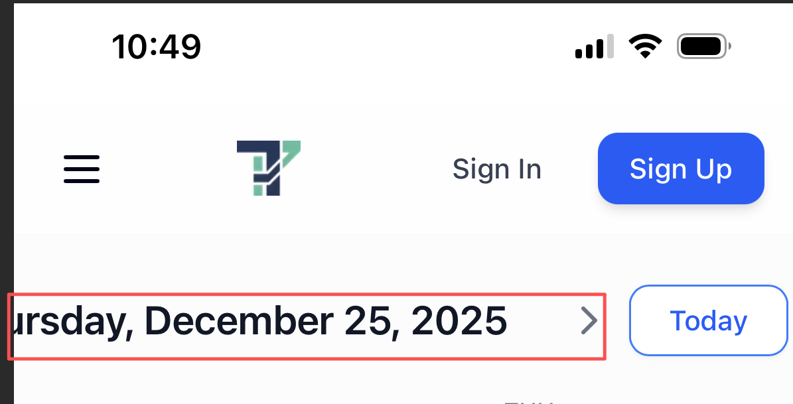
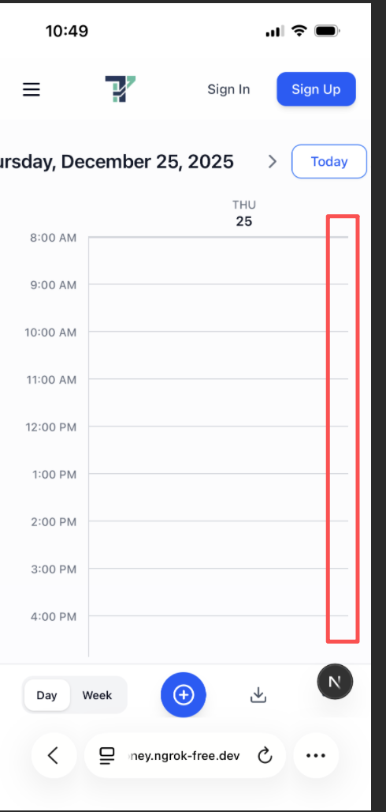
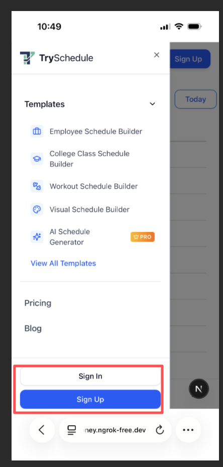

# 一、当我手机端访问本网站时，首页页面：

## 1、当前日期显示不全，而且左边的那个箭头也不见了

- 此处的日期和today按钮在一行上，导致日期和左边的箭头无法正常显示。
- 可否将Today按钮挪到其他地方，或者说让日历的字体显示的小一些，这样可以显示全部内容?

## 2、虽然已经切换到日视图了，但是日视图的右侧仍然无法完全显示。

- 高度范围内无法正常显示，是正常的，用户可以上下拖拽
- 但是宽度范围内无法正常显示，应该解决，因为日视图里本来也只显示一天的内容
- 

## 3、下方的day/week切换按钮仍然存在。

- 但是当我点击切换到Week时，按钮无效
- 如果点击Week按钮时有效，那么切换到week视图时，也需要对week视图的移动端进行适配
- 我认为这个地方的处理方案可以这么考虑，当用户用手机端访问时，默认的视图就是日视图。因为日视图的话更适合手机显示，但是如果用户执意要切换到week视图，那么week视图也要能正常显示。

# 二、增加事件卡片的功能：

当我点击增加新事件时，弹出的模态框如下图所示：

- 我认为这个模态框还是太大了，点击之后几乎占据了整个手机屏幕，可以适当再小一点点
- 内容无法完全正常显示
- 没有关闭按钮，也就是右上角的`X`号

# 三、页脚`footer`

- 红框范围里的内容可以显示为一行么？现在换行导致视觉效果上不太美观。

# 四、导航栏

- 当用户进入网站时，导航栏上已经显示了sign in和sign up的按钮
- 当我点击汉堡菜单时，展开的菜单里又出现了sign in和sign up的按钮。
- sign in和sign up的按钮是否有必要前后出现两次？
- 
- 